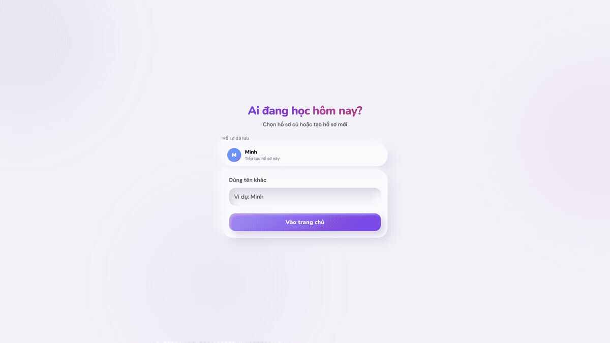
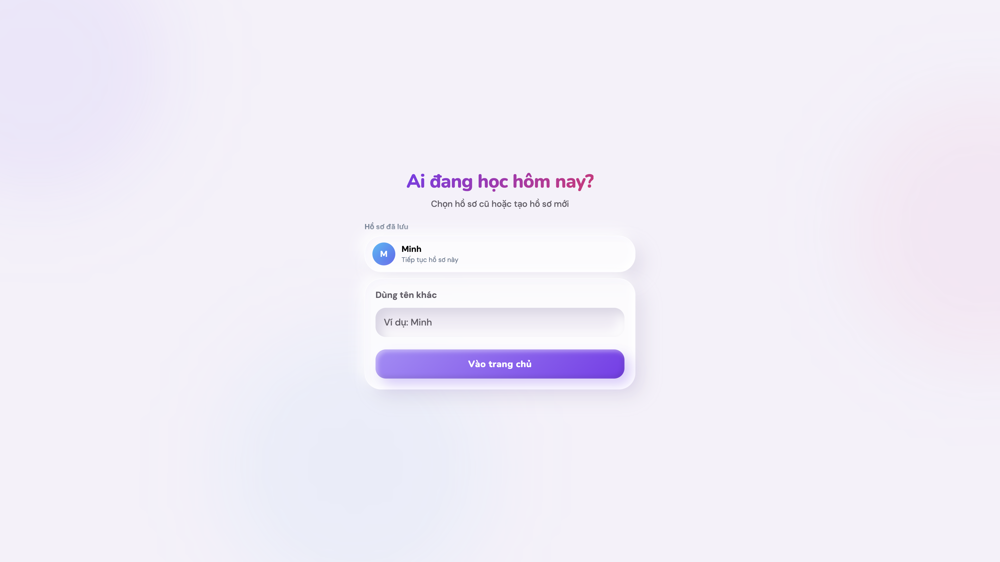
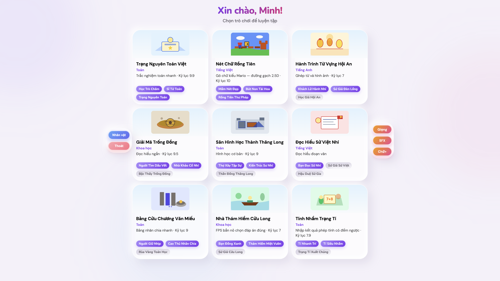
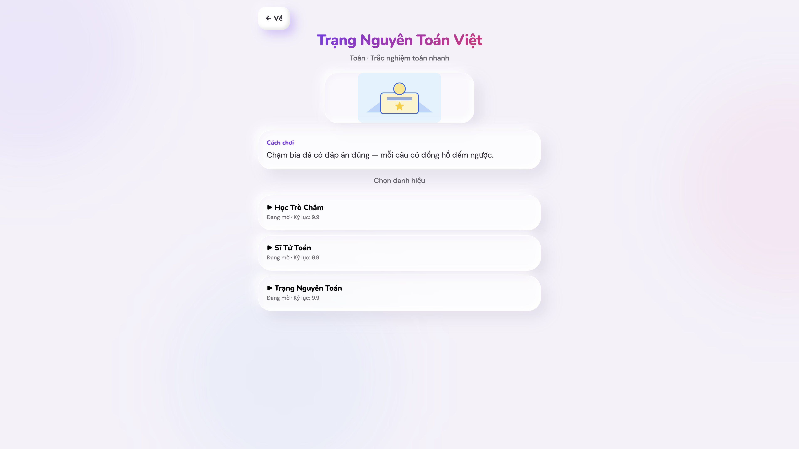
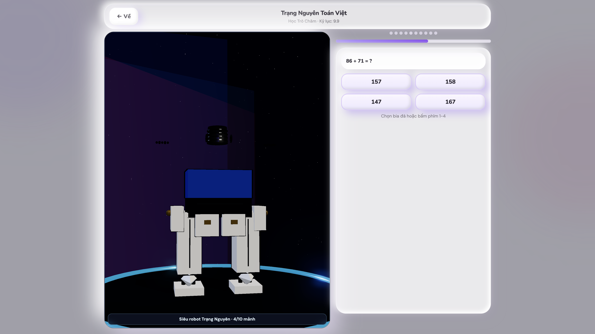
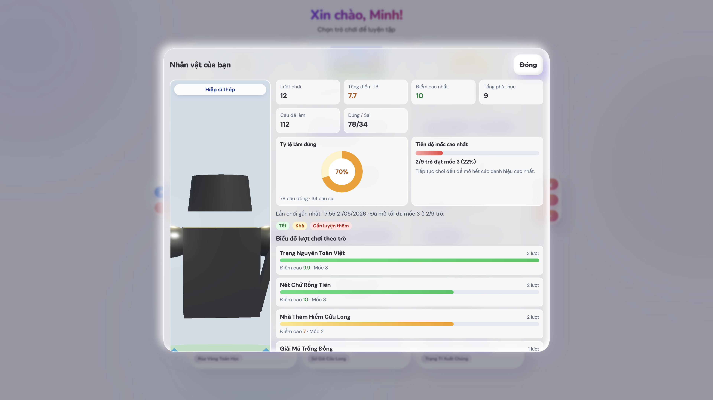

# KV Primary Fun Learning

Website game học tập lớp 4 — frontend only (HTML5 + Three.js + TypeScript).

## Chạy dự án

```bash
npm install
npm run dev
```

Mở URL do Vite in ra (thường `http://localhost:5173`).

**Quy trình:** Mỗi lần phát triển phải chạy web và test — xem `docs/workflow/DEVELOPMENT_WORKFLOW.md`.

## Build

```bash
npm run build
npm run preview
```

## Deploy GitHub Pages

- Repository URL: `https://github.com/kataro92/KPrimaryLearning`
- Public site URL: `https://kataro92.github.io/KPrimaryLearning/`

Sau khi push lên nhánh `main`, GitHub Actions sẽ tự build và deploy từ thư mục `dist`.

## Trạng thái triển khai

- Frontend-only: Vite + TypeScript + Three.js, không có backend.
- **9/9 game** đang playable với màn chọn danh hiệu, gameplay riêng, kết quả + celebration.
- Persistence local hoạt động qua IndexedDB (`profile`, `progress`, `sessions`) và localStorage (`settings`).
- TTS runtime hiện tại dùng Web Speech API; hướng nâng cấp local-first được mô tả tại `docs/planning/TTS_LOCAL_ARCHITECTURE.md`.
- Build hiện tại pass (`npm run build`), có cảnh báo chunk size cần tối ưu thêm.

## Giao diện

Claymorphism (thẻ kính, nút nổi, nền blob) — chi tiết: [`docs/STYLING.md`](docs/STYLING.md).

## Test nhanh & ảnh tính năng

- Smoke test local trên `http://localhost:5173`.
- Build kiểm tra phát hành: `npm run build` (pass).
- Đã đi qua các luồng chính: Welcome -> Home -> Chọn game/danh hiệu -> Gameplay -> Báo cáo nhân vật.

### GIF demo nhanh



### 1) Màn hình Welcome



### 2) Home (dashboard 9 game + toggle nhanh)



### 3) Chọn game và danh hiệu



### 4) Gameplay (ví dụ Trạng Nguyên Toán Việt - giữa trận)



### 5) Báo cáo nhân vật và tiến độ



## Tài liệu

- `docs/README.md` (điểm vào chính cho toàn bộ tài liệu)
- `docs/requirements/BUSINESS_REQUIREMENTS.md`
- `docs/requirements/TECHNICAL_REQUIREMENTS.md`
- `docs/planning/IMPLEMENTATION_ROADMAP.md`
- `docs/planning/TTS_LOCAL_ARCHITECTURE.md`
- `docs/status/CURRENT_STATE.md`
- `docs/workflow/DEVELOPMENT_WORKFLOW.md`
- `docs/workflow/DOCS_DEFINITION_OF_DONE.md`
- `docs/GLOSSARY.md`
- `docs/STYLING.md`

`docs/requirements/TECHNICAL_REQUIREMENTS.md` và `docs/planning/IMPLEMENTATION_ROADMAP.md` là nguồn mô tả hiện trạng kỹ thuật mới nhất.

## Cursor-first

- Quy tắc cho Cursor Agent nằm trong `.cursor/rules/`.
- Rule mặc định giúp agent ưu tiên đọc tài liệu trong `docs/` trước khi thay đổi code.
