# Kế hoạch tích hợp SGK lớp 4 — `pdfs/` → game hiện tại

**Ngày:** 2026-05-24  
**Nguồn:** Thư mục `pdfs/` trong repo + hiện trạng 10 game trong `src/games/catalog.ts`.

## 1. Tóm tắt

Bạn đã cung cấp **12 file PDF** (KNTT + CTST + Tiếng Anh + một số môn phát triển). Đây là cơ sở để **bám sát chương trình** thay vì chỉ dựa vào đề tham khảo hoặc câu tự ghép.

**Định hướng (cập nhật 2026-05-24):**

| Quyết định | Lý do |
|------------|--------|
| **KNTT + CTST dùng song song** | Cùng **đề cương** Chương trình GDPT 2018 / TT22–27 lớp 4; chỉ khác cách diễn đạt và bố cục bài. |
| **Nguồn tải SGK** | [Thư viện TH Nguyễn Văn Trỗi (PM)](https://nguyenvantroipm.edu.vn/thu-vien/?theloai=sach-giao-khoa&lop_hoc=L%E1%BB%9Bp+4) — `npm run fetch:sgk` → `pdfs/`; chi tiết `docs/content/SGK_DOWNLOAD_SOURCES.md`. |
| **Không sao chép nguyên đề/bài tập có bản quyền** | Chỉ trích **đoạn đọc, thơ, bài chính tả, chủ đề, dạng bài**; câu game soạn theo mục tiêu SGK. |
| **`sgkRef` theo chủ đề/bài CT, không theo NXB** | Vd. `tv-hk1-chinh-ta-26`, `toan-hk2-phan-so-03`; trường `series: kntt\|ctst` chỉ để truy vết PDF. |

**Hạn chế kỹ thuật (đã kiểm tra bằng `pypdf`):**

- Một số PDF **scan + watermark** (vd. *Toán 4 KNTT tập 1*, *Family and Friends*) → `extract_text()` gần như không dùng được; cần **OCR** hoặc bản PDF text từ NXB / Hành trang số.
- *Tiếng Việt CTST* tập 1: font lỗi / mã hóa lạ trên nhiều trang → OCR hoặc nhập mục lục thủ công.
- *Sử–Địa KNTT*: trích được **một phần** (tiêu đề bài, Hình 1–8, đoạn địa lí) — đủ để **đối chiếu** bank hiện có, chưa đủ để tự động hóa toàn bộ.
- *Sử–Địa CTST*: trích được **mục lục 6 chủ đề + ~27 bài** — khớp ma trận `suDiaCoverage.ts`.

---

## 2. Kho SGK trong `pdfs/`

| File | Bộ | Môn | Ước trang | Ghi chú trích xuất |
|------|-----|-----|-----------|-------------------|
| `SGK Toán 4 KNTT tập 1.pdf` | KNTT | Toán HK1 | ~135 | Watermark scan — **cần OCR** |
| `SGK Toán 4 CTST tập 2.pdf` | CTST | Toán HK2 | ~87 | Watermark scan — **cần OCR** |
| `tieng-viet-lop-4-tap-1-chan-troi-sang-tao.pdf` | CTST | TV HK1 | ~155 | Text lỗi font — OCR / mục lục tay |
| `tieng-viet-lop-4-tap-2-chan-troi-sang-tao-pdf.pdf` | CTST | TV HK2 | ~143 | Tương tự T1 |
| `SGK Lịch sử và Địa lí 4 KNTT.pdf` | KNTT | Sử–Địa | ~127 | Trích được đoạn địa lí + hình; dùng cho QA bank |
| `SGK Lich su va Dia li 4 - CTST.pdf` | CTST | Sử–Địa | ~119 | Mục lục 6 chủ đề rõ |
| `2 Family and Friends 4.pdf` | NXB | Tiếng Anh | ~107 | Watermark — OCR hoặc lấy unit list từ Teacher's Guide |
| `SGK Cong nghe 4 - CTST.pdf` | CTST | Công nghệ | ~79 | Mục lục bài (Hoa, bộ lắp ghép…) |
| `SGK Dao duc 4 - CTST.pdf` | CTST | Đạo đức | ~67 | 12+ bài hành vi (quyền trẻ em, bạn bè…) |
| `SGK Am nhac 4 - CTST.pdf` | CTST | Âm nhạc | ~63 | Chưa có game |
| `SGK Mĩ thuật 4 CTST BẢN 1.pdf` | CTST | Mĩ thuật | ~82 | Chưa có game |
| `SGK My thuat 4 - CTST BẢN 2.pdf` | CTST | Mĩ thuật | ~79 | File có vẻ lẫn metadata sách khác — kiểm tra lại file |

### Thiếu trong `pdfs/` (tải thêm từ thư viện trường hoặc Hành trang số)

| Thiếu | Ảnh hưởng game | Ghi chú |
|-------|----------------|---------|
| Khoa học 4 **KNTT** tập 1 & 2 | Trống Đồng, Cửu Long | Chưa thấy trên trang lọc lớp 4 PM — tải NXB khi có |
| Toán 4 **KNTT** tập 2 | HK2 — Trạng Nguyên, Trạng Tí | Có **Toán Cánh Diều T2** trên thư viện PM |
| Tiếng Việt 4 **KNTT** tập 1 & 2 | Bút Sen (bổ sung) | Đã có **CTST** đủ 2 tập trên PM + trong `pdfs/` |
| Đạo đức, Âm nhạc, Mĩ thuật | Game Đạo đức (đề xuất) | Một phần đã có local CTST |

Trên thư viện PM, nhãn **«Cánh Diều»** = bộ ĐHSP (song song CTST); không loại trừ KNTT khi soạn câu.

---

## 3. Khung chương trình lớp 4 (ánh xạ môn → game)

Theo **Thông tư 22** (lớp 4): Toán, Tiếng Việt, Ngoại ngữ, Khoa học (gộp Sinh–Vật–Địa lý tự nhiên), Lịch sử và Địa lí, Đạo đức, Hoạt động trải nghiệm; CTST/KNTT chia **HK1 / HK2** theo từng tập sách.

### 3.1. Game hiện có (10)

| Game | Môn SGK | HK1 | HK2 | Mức bám SGK hiện tại |
|------|---------|-----|-----|----------------------|
| Trạng Nguyên Toán | Toán | Một phần | Một phần | Bank lớn; **chưa gắn `sgkRef` theo bài** |
| Tính Nhẩm Trạng Tí | Toán | Có | Có | Cùng chủ đề; thiếu tag bài |
| Bảng Cửu Chương Văn Miếu | Toán | Có | Ôn | Bảng nhân/chia — ổn toàn CT |
| Săn Hình Học Thăng Long | Toán | Hình học HK1 | Mở rộng | 250 nhãn; cần map **Chủ đề hình học KNTT** |
| Bút Sen Việt | TV — Chính tả | Đang làm | Đang làm | **Đã** trích SGK; cần mở rộng từ PDF CTST |
| Đọc Hiểu Sử Việt | TV — Đọc (sử) | Có | Có | Đoạn sử quốc gia; tách khỏi địa lí |
| Hành Trình Sử & Địa | Lịch sử & Địa lí | ~6 chủ đề | HK2 | **~200 câu**, 8 `sgkUnit`; đối chiếu PDF KNTT |
| Hành Trình Từ Vựng Hội An | Tiếng Anh | Unit 1–6 | Unit 7–12 | Cần map **Family & Friends 4** từ PDF |
| Giải Mã Trống Đồng | Khoa học | Chủ đề HK1 | HK2 | Passage tổng hợp; **cần gắn bài SGK KH** |
| Nhà Thám Hiểm Cửu Long | Khoa học (ĐBSCL) | Một phần | ĐBSCL | Thiên nhiên vùng Nam; map bài KH + địa lí |

### 3.2. Môn có PDF nhưng **chưa có game**

| Môn (PDF) | Đề xuất | Độ ưu tiên |
|-----------|---------|------------|
| Đạo đức CTST | **“Chọn hành động đúng”** — 3 lựa chọn, tình huống ngắn theo từng bài (Bài 1–12) | P2 |
| Công nghệ CTST | **“Thợ nhí an toàn”** — ghép dụng cụ / quy tắc (bài Hoa, lắp ghép…) | P3 |
| Âm nhạc / Mĩ thuật | Chỉ nên làm nếu có nhu cầu rõ; khó gamify bám CT | P4 |

---

## 4. Ma trận nội dung SGK → hành động cập nhật

### 4.1. Toán (KNTT T1 + CTST T2)

**Chủ đề TT22 / KNTT HK1 (từ ma trận đề + sách):**

- Ôn tập và bổ sung; số đến 100 000; phép cộng/trừ; nhân/chia; biểu thức; đơn vị đo; hình học (góc, chu vi, diện tích); thống kê cơ bản.

**Chủ đề HK2 (CTST T2 / KNTT T2 khi có PDF):**

- Phân số; đo lường; ôn tập cuối năm.

| Game | Hành động |
|------|-----------|
| Trạng Nguyên | Gắn mỗi MCQ `sgkRef: toan-kntt-t1-bai-XX` + `topic`; ưu tiên bài có trong PDF sau OCR |
| Trạng Tí | Cùng tag; level 2–3 tăng độ khó trong cùng bài |
| Cửu Chương | Map bảng 2–9 theo tuần SGK (tuần 1–18 HK1) |
| Hình học Thăng Long | Liệt kê **tên hình/khối** trong SGK Toán (HCN, HV, tam giác, góc…) → `objectBank` metadata |

### 4.2. Tiếng Việt (CTST T1–T2)

**Cấu trúc CTST (mỗi tập):** Tập đọc → Chính tả → LT&C → TLV → Kể chuyện (lặp theo chủ điểm).

| Game | Hành động |
|------|-----------|
| Bút Sen | **Phase A:** Lập `docs/content/SGK_TV4_CTST_INDEX.yaml` — mọi bài *Chính tả* + trang; trích nguyên văn vào bank (s/x, ch/tr, l/n, d/gi/r, dấu hỏi/ngã). **Phase B:** Thêm KNTT TV khi có PDF. |
| Đọc Hiểu Sử Việt | Chỉ giữ **đoạn lịch sử** (Văn Lang → 1945); lấy tên bài *Tập đọc* từ mục lục CTST làm `sgkRef`; không dùng câu địa lí thuần |

**Bài chính tả ưu tiên từ CTST (sau khi có mục lục đầy đủ):** toàn bộ bài *Nghe–viết* / *Nhớ–viết* trong 2 tập — không dùng `generate:questions` tự ghép.

### 4.3. Lịch sử & Địa lí (KNTT + CTST)

**6 chủ đề (khớp CTST mục lục & `ALL_SGK_UNITS`):**

1. Địa phương em  
2. Trung du và miền núi Bắc Bộ  
3. Đồng bằng Bắc Bộ  
4. Duyên hải miền Trung  
5. Tây Nguyên  
6. Nam Bộ (ĐBSCL)

| Game | Hành động |
|------|-----------|
| Hành Trình Sử & Địa | Đối chiếu từng câu với PDF (địa danh, Hình 1); bổ sung câu **mô tả thiên nhiên / dân cư** đúng nguyên văn SGK; bản đồ SVG vector |
| Đọc Hiểu Sử Việt | Rà soát `historyBank` — chuyển câu địa lí sang Sử–Địa (đã có hướng dẫn trong `SGK_LICH_SU_DIA_LI_4_KNTT.md`) |

### 4.4. Khoa học (thiếu PDF KNTT — tạm dùng ma trận đề + CTST nếu bổ sung)

**Chủ đề HK1 thường gặp:** Vật chất; nước; không khí; âm thanh; ánh sáng; Trái Đất–Mặt Trời; cơ thể (tiêu hóa, dinh dưỡng).

| Game | Hành động |
|------|-----------|
| Trống Đồng | Thay passage tổng hợp bằng **đoạn rút gọn từ SGK** (1 đoạn = 1 bài đọc KH); `sgkRef` + 3 câu Đ/S hoặc MCQ |
| Cửu Long | Gắn câu với bài **ĐBSCL / môi trường nước** trong KH HK2; nhãn động vật/thực vật đúng SGK Miền Nam |

### 4.5. Tiếng Anh (Family and Friends 4)

| Game | Hành động |
|------|-----------|
| Hội An | Lập bảng **Unit → từ vựng → câu mẫu** từ PDF (hoặc sách giáo viên); level 1 = unit đầu, level 3 = tổng hợp; thêm `sgkRef: ff4-unit-N` |

---

## 5. Lộ trình triển khai (đề xuất)

```mermaid
flowchart LR
  subgraph phase0 [P0 - 1 tuần]
    A[pdfs inventory + gitignore lớn]
    B[SGK_INDEX YAML theo môn]
    C[OCR pipeline hoặc PDF NXB sạch]
  end
  subgraph phase1 [P1 - 2-3 tuần]
    D[Bút Sen + TV index]
    E[Sử-Địa QA vs PDF]
    F[Hội An unit map]
  end
  subgraph phase2 [P2 - 3-4 tuần]
    G[Toán sgkRef + HK tag]
    H[KH passages từ SGK]
    I[Tắt generate câu bịa]
  end
  subgraph phase3 [P3 - tùy chọn]
    J[Game Đạo đức]
    K[Game Công nghệ nhẹ]
  end
  phase0 --> phase1 --> phase2 --> phase3
```



### P0 — Hạ tầng nội dung (bắt buộc)

1. **`docs/content/SGK_MASTER_INDEX.md`** + **`scripts/data/sgk-index.json`** — `npm run extract:sgk-index`.
2. **OCR** (tùy chọn) cho PDF scan: Toán, TV đã có mục lục curated trong JSON.
3. **`.gitignore` cho `pdfs/*.pdf`** (file rất lớn, ~1.7 GB tổng) — giữ `pdfs/README.md` + index; PDF chỉ local/CI artifact.
4. **Quy tắc:** Cấm `npm run generate:questions` tạo câu **không có** `sgkRef` (đã làm một phần với Bút Sen).

### P1 — Game “văn bản SGK” (chất lượng cao nhất)

| Thứ tự | Game | Deliverable |
|--------|------|-------------|
| 1 | Bút Sen Việt | ≥80 câu/trình độ, 100% trích CTST/KNTT; file index đầy đủ |
| 2 | Hành Trình Sử & Địa | QA 200 câu vs PDF; sửa sai địa danh; thêm câu theo bài 8–27 |
| 3 | Hội An | 12 unit × 15–20 cặp từ; gắn `sgkRef` |

### P2 — Game “kỹ năng / toán / KH”

| Thứ tự | Game | Deliverable |
|--------|------|-------------|
| 4 | Trạng Nguyên + Trạng Tí + Cửu Chương | Tag `sgkRef` + coverage HK1/HK2 |
| 5 | Trống Đồng + Cửu Long | ≥30 passage SGK; bỏ supplement tổng hợp không nguồn |
| 6 | Hình học Thăng Long | Map nhãn → mục tiêu bài Toán |

### P3 — Game mới (đề xuất)

#### A. **Đạo Đức Nhí** (`dao-duc-nhi`) — CTST

- **Cơ chế:** Tình huống 2–3 câu thoại → chọn hành động đúng (hoặc Đúng/Sai).
- **Nguồn:** `SGK Dao duc 4 - CTST.pdf` — Bài 1–12.
- **3 danh hiệu:** Bạn Ngoan / Trái Tim Ấm / Người Bạn Đáng Tin.
- **Lý do:** Bám CT, không cần 3D nặng, phù hợp lứa tuổi.

#### B. **Câu Chuyện Đất Việt** (`cau-chuyen-dat-viet`) — TV CTST Tập đọc

- **Cơ chế:** Đọc đoạn rút gọn (≤120 từ) → 1 câu hỏi ý chính MCQ (khác Đọc Hiểu Sử thuần timeline).
- **Nguồn:** Các bài Tập đọc CTST (không phải toàn bộ TLV).
- **Bổ sung** cho Đọc Hiểu Sử (sử) và Bút Sen (chính tả).

#### C. **Thợ Nhí Công Nghệ** (`tho-nhi-cong-nghe`) — CTST (tùy chọn P3)

- Ghép thẻ: dụng cụ ↔ việc làm; quy tắc an toàn.

**Không đề xuất gấp:** Âm nhạc / Mĩ thuật dạng quiz — lệch mục tiêu môn.

---

## 6. Công cụ & quy ước dữ liệu

### 6.1. Mã `sgkRef` (thống nhất — theo **đề cương**, không theo NXB)

```
{môn}-hk{1|2}-{loại}-bai-{NN}   vd: tv-hk1-chinh-ta-26
{môn}-hk{1|2}-doc-{NN}         vd: toan-hk1-bai-12
su-dia-chu-de-3-bai-8
ff4-unit-5
```

Metadata tùy chọn khi cần truy PDF: `series: "kntt" | "ctst" | "cd"`, `sourceFile: "tieng-viet-lop-4-tap-1-chan-troi-sang-tao.pdf"`.

### 6.2. File repo đề xuất

| File | Mục đích |
|------|----------|
| `docs/content/SGK_MASTER_INDEX.md` | Con người đọc — bảng bài ↔ trang |
| `scripts/data/sgk-index.json` | Máy đọc — sinh bank, kiểm coverage |
| `docs/content/SGK_TV4_CTST_CHINH_TA.md` | Mở rộng `SGK_TIENG_VIET_4_CHINH_TA.md` |
| `docs/content/SGK_TOAN4_KNTT.md` | Chủ đề + số bài |
| `docs/content/SGK_KHOA_HOC4.md` | Khi có PDF |
| `pdfs/README.md` | Danh sách file + bản quyền + hướng dẫn OCR |

### 6.3. Kiểm tra coverage (CI nhẹ)

- Script đếm: mỗi `sgkUnit` / `sgkRef` có ≥ N câu.
- Fail build docs nếu game playable thiếu coverage HK1 (tùy chọn, phase 2).

---

## 7. Rủi ro & việc làm ngay

| Rủi ro | Giảm thiểu |
|--------|------------|
| PDF scan không trích được chữ | OCR (macOS Vision / `ocrmypdf`); hoặc tải bản **Hành trang số** NXBGD |
| Lẫn CTST vs KNTT trong một game | Ghi rõ trên UI “Theo sách CTST” / “KNTT”; hoặc chọn **một bộ** cho toàn app |
| Repo phình GB vì PDF | `gitignore` + README; không commit PDF |
| Bản quyền NXB | Chỉ trích đoạn ngắn phục vụ giáo dục; không publish nguyên sách |

**Việc nên làm trước khi code bank lớn:**

1. `npm run fetch:sgk` — đồng bộ PDF từ [thư viện PM](https://nguyenvantroipm.edu.vn/thu-vien/?theloai=sach-giao-khoa&lop_hoc=L%E1%BB%9Bp+4); bổ sung tay Khoa học KNTT khi có link.  
2. Chạy OCR trên bản scan → `scripts/data/sgk-index.json`.  
3. Soạn câu với `sgkRef` theo **bài/chủ đề CT**; trích từ CTST hoặc KNTT tùy đoạn hay hơn.

---

## 8. Liên kết tài liệu hiện có

- `docs/content/EXAM_SOURCES_GRADE4.md` — ma trận đề (bổ sung, không thay SGK).
- `docs/content/SGK_LICH_SU_DIA_LI_4_KNTT.md` — Sử–Địa.
- `docs/content/SGK_TIENG_VIET_4_CHINH_TA.md` — Bút Sen.
- `docs/planning/GAME_BUT_SEN_AND_SU_DIA.md` — chi tiết 2 game.
- `docs/planning/IMPLEMENTATION_ROADMAP.md` — backlog kỹ thuật.

---

## 9. Tóm tắt đề xuất game mới

| Game | Môn | Nguồn PDF | Ưu tiên |
|------|-----|-----------|---------|
| Đạo Đức Nhí | Đạo đức | `SGK Dao duc 4 - CTST.pdf` | Cao (P3) |
| Câu Chuyện Đất Việt | TV đọc hiểu | TV CTST T1–T2 | Trung bình |
| Thợ Nhí Công Nghệ | Công nghệ | `SGK Cong nghe 4 - CTST.pdf` | Thấp |

**10 game hiện tại** vẫn đủ phủ lõi CT lớp 4 nếu hoàn thành P1–P2; game mới chỉ mở rộng môn chưa có (Đạo đức) hoặc dạng đọc hiểu văn học.
