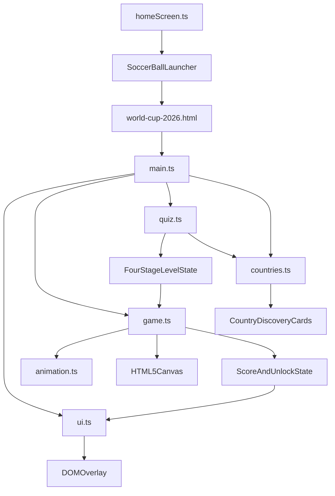

# Standalone World Cup 2026 Game Plan

## Goal

Build a standalone HTML5 game page where the player answers football and culture quiz questions to shoot the ball past defenders, then beats a goalkeeper in a final boss battle to unlock a short country discovery card. The game starts with 12 featured World Cup 2026 countries and keeps the data shape ready for expansion to all 48 teams.

## Product Scope

- Create a standalone entry page at `world-cup-2026.html`, separate from the existing app entry at `src/main.ts`.
- Use HTML5 Canvas 2D plus TypeScript for the soccer scene, with DOM overlays for questions, answers, lives, country facts, score, timer, and results.
- MVP countries: 12 featured countries from World Cup 2026 coverage, using neutral educational content and avoiding unsupported claims where qualification may still be changing.
- Country content per team:
  - Culture: 1 short kid-friendly fact.
  - Football history: national team or football culture fact, plus optional club-history note when strongly relevant.
  - Signature food: 1 well-known dish.
  - Figure: 1 notable footballer, coach, or cultural figure.
- Gameplay loop:
  - Choose a country path.
  - Play a 4-stage soccer quiz level for that country.
  - Answer A/B/C questions to choose the shot type and send the ball past defenders.
  - Keep 3 shooting lives; wrong answers let defenders block the ball and remove 1 life.
  - Beat the goalkeeper boss battle to score, reveal that country's discovery card, and unlock the next country.
- Home screen launcher:
  - Add a small soccer ball icon button on the main Home screen, centered between the existing `Nhân vật` and `Thoát` buttons in the left profile dock.
  - Tapping the icon opens the standalone World Cup 2026 game entry page.

## Main Screen Launcher Design

- Placement:
  - Use the existing `profile-dock` on the Home screen in `src/ui/screens/homeScreen.ts`.
  - Insert a new center launcher between `#btn-character` and `#btn-logout`.
  - Dock order becomes: `Nhân vật` -> soccer ball icon -> `Thoát`.
- Visual style:
  - Icon-only button, smaller than the text chips above and below.
  - Use a simple inline SVG or lightweight procedural soccer-ball icon with black/white pentagon pattern.
  - Keep the same clay dock style: rounded chip, soft shadow, hover lift, and tooltip.
  - Suggested size: about 36-40px wide, visually smaller than the two text buttons.
- Interaction:
  - Tooltip text: `World Cup 2026` or `Bóng đá World Cup`.
  - Click opens `world-cup-2026.html` in the same tab for MVP.
  - Optional later: return-to-home link inside the standalone game.
- Accessibility:
  - `aria-label`: `Mở game World Cup 2026`.
  - Minimum touch target 44x44px even if the visible icon is smaller.

## Technical Design

- Add standalone source files under `src/standalone/world-cup-2026/`:
  - `main.ts`: bootstrap, screen state, event wiring.
  - `game.ts`: canvas loop, scene state, player, ball, defenders, goalkeeper, shooting animations.
  - `countries.ts`: typed country data and quiz question data for the 12-country MVP.
  - `quiz.ts`: question selection, stage difficulty, answer validation, retry logic.
  - `animation.ts`: reusable timing helpers for idle, kick, block, scroll, goal, and defeat sequences.
  - `ui.ts`: menus, fact cards, HUD, result screen.
  - `styles.css`: standalone responsive styling.
  - `types.ts`: shared game and content types.
- Keep gameplay independent from `src/games/registry.ts` and `src/games/catalog.ts`, but add a Home-screen launcher in `src/ui/screens/homeScreen.ts` so players can open the standalone game from the main screen.
- Add launcher styling in `src/styles/global.css` for the center soccer-ball dock button, including a middle-item style so `:first-child` and `:last-child` colors still apply only to Character and Quit.
- Reuse the repo's Vite + TypeScript build setup from `package.json`; no new framework or heavy asset pipeline.
- Use procedural Canvas drawing first: pitch, player, ball, defenders, goalkeeper, goal, flags/colors, shot trails, hit sparks, and simple celebration effects. Add real images only later if licensing is clear.

## Architecture

## Gameplay Rules

- Controls:
  - Desktop: click answer A/B/C or press keys `1`, `2`, `3`; optional Space confirms the highlighted answer.
  - Touch: tap large answer buttons A/B/C.
- Level structure:
  - Each country level has 4 stages.
  - Stages 1-3 are defender duels with increasing question difficulty: Easy, Medium, Hard.
  - Stage 4 is a goalkeeper boss battle with a special hard question or short question chain.
- Shooting lives:
  - Player starts each country level with 3 shooting lives shown as golden football icons.
  - Correct answer keeps lives unchanged and advances to the next stage.
  - Wrong answer removes 1 life and replays the same stage with either the same question or a replacement question at the same difficulty.
  - When lives reach 0, show Defeat with Retry from the start of that country level.
- Shot types:
  - Answer A: high lob shot.
  - Answer B: straight mid-height shot.
  - Answer C: low ground shot.
- Defender and goalkeeper behavior:
  - On correct answers, defenders guess the wrong direction and the ball passes them.
  - On wrong answers, defenders or the goalkeeper block the ball and send it back to the striker.
- Scoring:
  - Country completed when the player beats the goalkeeper and scores.
  - Bonus points for lives remaining, correct streak, and fast answers.
- Feedback:
  - Immediate text feedback for answer selection, correct shot, blocked shot, lost life, goal, and defeat.
  - Short celebratory animation after the final goal.

## Scene And Animation Design

- Fixed HUD area:
  - Progress bar at the top center with 4 nodes: Defender 1, Defender 2, Defender 3, Goalkeeper/Cup.
  - Lives UI at the top-left using 3 golden football icons. Lost lives turn gray and play a small break animation.
  - Question box across the upper center with concise text.
  - Three answer buttons A, B, C below the question box.
- Field area:
  - Striker starts near the left side with the ball at the foot.
  - Defender stands near the right side for stages 1-3.
  - Goalkeeper and goal appear on the right side for stage 4.
- Idle scene:
  - Striker lightly bounces and faces right.
  - Defender shifts left and right in a defensive stance.
- Answer selection:
  - Selected answer scales up and blinks with a soft yellow outline.
  - Non-selected answers fade out quickly before the kick begins.
- Correct answer:
  - Striker takes a short run-up and kicks.
  - Ball follows the selected shot path: high lob, mid shot, or low ground shot.
  - Defender reacts the wrong way and misses.
  - Screen scrolls right, the striker follows the ball, and the next defender or goalkeeper enters.
- Wrong answer:
  - Striker still shoots using the selected path.
  - Defender or goalkeeper blocks the ball with a jump, slide, punch, or catch.
  - A small red hit effect appears at the block point.
  - Ball returns to the striker, the striker shows disappointment, and 1 life is removed.
- Boss battle victory:
  - Goalkeeper dives but misses.
  - Ball hits the net, the net shakes, and the victory text appears: `MÀN CHƠI HOÀN THÀNH - GOAL!!!`
  - Striker celebrates with a knee slide and the country discovery card opens.

## Content Safety

- Write facts in concise Vietnamese by default to match the existing project.
- Keep claims factual and non-political.
- For club history, avoid saying a national team "belongs" to a club. Phrase it as "many famous players developed at clubs such as..." only when accurate.
- Mark country qualification/content as data-driven so the 12-country MVP can be corrected or expanded without changing gameplay code.

## Testing And Verification

- Run `npm run build` after implementation.
- Manually test desktop and touch-like controls:
  - Open Home screen and verify the soccer ball icon appears centered between `Nhân vật` and `Thoát`.
  - Click the soccer ball icon and confirm it opens the standalone World Cup game.
  - Start game.
  - Select answers with mouse/touch and keyboard.
  - Complete stages 1-3 by passing defenders.
  - Complete stage 4 by scoring against the goalkeeper.
  - Lose a life on a wrong answer.
  - Reach Defeat when all 3 lives are lost.
  - Open country card.
  - Continue to next country.
- Check responsive layout at laptop and tablet widths.

## Follow-Up Expansion

- Expand `src/standalone/world-cup-2026/countries.ts` from 12 countries to all 48 once the final World Cup 2026 field is known.
- Add country-specific pitch skins, stadium ambience, and optional audio.
- Add local progress saving with `localStorage` after the MVP loop is stable.
- Add a later real-time dribble mode if the quiz-shot MVP feels too static after playtesting.

## Implementation Todos

- Add the soccer ball launcher button to the Home screen profile dock, centered between Character and Quit.
- Add the standalone HTML entry and TypeScript bootstrap for the World Cup 2026 game.
- Create typed 12-country MVP content covering culture, football history, signature food, and figure.
- Create the quiz engine for 4-stage country levels, A/B/C answers, difficulty, retry, and lives.
- Implement Canvas 2D striker, ball, defender, goalkeeper, shot paths, block, scroll, goal, defeat, and victory animations.
- Implement responsive menus, HUD, answer buttons, lives UI, country discovery cards, and result flow.
- Run build and manually verify correct, wrong, defeat, boss victory, desktop, and touch-control paths.
